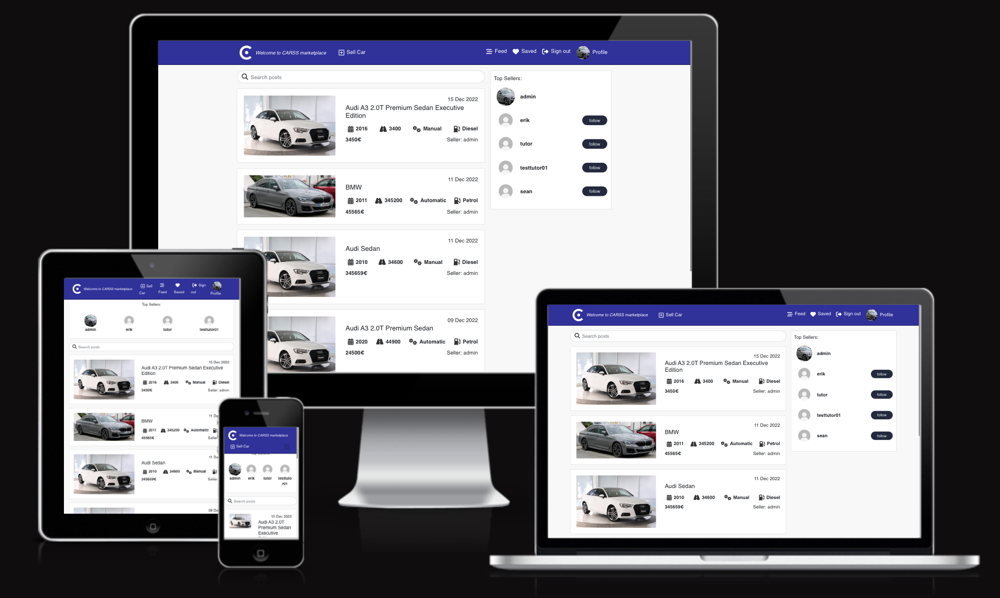

<h1 align="center">CARSS - A vehicle marketplace!</h1>
<h2 align="center"></h2>

CARSS is a vehicle marketplace platform designed for used cars. It allows for the users to create their own listing to sell their used car. As a visitor you can also search for used cars in case you are looking to buy a car. The users can register for the website and gain access to more features such as saving your favourite cars that you are most interested in as well as follow certain car dealerships on order to be aware of what their latest inventory are. 

This part of the project is the frontend part based on the React framework, it consist of the user interface that connects and interact with the backend API through http requests.
         
[View the live project here.](https://carss-react.herokuapp.com/)

### Links to the Backend API Project

- [Frontend - Repository](https://github.com/ErikHgm/carss-drf-backend)
- [Frontend - Deployment](https://carss-drf-backend.herokuapp.com/)

## TOC

- [User Experience (UX)](#user-experience-ux)
  - [User Stories](#user-stories)
  - [Agile Methodology](#agile-methodology)
  - [Design](#design)
  - [Wireframes](#wireframes)
- [Features](#features)
  - [Future Features](#future-features)
- [Technologies Used](#technologies-used)
  - [Languages Used](#languages-used)
  - [Frameworks Used](#frameworks-used)
- [Testing](#testing)
  - [Bugs](#bugs)
    - [Fixed Bugs](#fixed-bugs)
    - [Remaining Bugs](#remaining-bugs)
- [Deployment](#deployment)
  - [Forking the GitHub Repository](#forking-the-github-repository)
  - [Making a Local Clone](#making-a-local-clone)
  - [Deploying with Heroku](#deploying-with-heroku)
- [Credits](#credits)
  - [Code](#code)
  - [Media](#media)
  - [Acknowledgments](#acknowledgments)

## User Experience (UX)

- ### User stories

  - #### First Time Visitor Goals
  - #### Returning Visitor Goals

  - #### Frequent User Goals

- ### Agile methodology

- ### Design

- ### Wireframes
  A separate document for wireframes can be found [here](/docs/assets/wireframes/WIREFRAMES.md).

## Features

### Navbar & Search
- The navbar and searchbar 

  

### Cars List page
- The Cars List page 

  

### Car Detail page
- The Car Detail page 

  

## Car Edit page
- The Car edit page 

  

## Profile page
- The profile page 

  

## Edit Profile
- Edit profile  

  

## Feed page
- The Feed page 

  

## Saved page
- The saved page 

  

### Future Features
  - Allow for more search options and filters based on different criteria.
  - Implement a rating system for the buyers to rate sellers in order to increase trust and credibility of the service.
  - Implement a location algorithm to allow user to search for cars/sellers within a certain distance.
  - Implement the functionality for an image gallery to allow the sellers to upload more pictures of the cars.

## Technologies Used

### Languages

- JavaScript
- HTML5
- CSS3

### Frameworks, Libraries & Programs Used

- [React](https://reactjs.org/) - (Front-end JavaScript library for building user interfaces based on UI components)

- [React Bootstrap](https://react-bootstrap.github.io/) - Component-based library that provides native Bootstrap components as pure React components[1](https://www.pluralsight.com/guides/how-to-set-up-a-react-bootstrap-app). Used to create a responsive application/component UI.
- [Axios](https://axios-http.com/) - Promise based HTTP client for the browser and node.js. Used to make HTTP requests from throughout the application.
- [jwt-decode](https://github.com/auth0/jwt-decode) - Used to decode and extract information from a JWT token.
- [react-router-dom](https://www.npmjs.com/package/react-router-dom) - Routing library for the React Javascript library. Used to display different components based on the URL entered in the browser.

- [drawSQL](https://drawsql.app/) - Create Database Schema/ERD
- [Git](https://git-scm.com/) - Git was used for version control, using the terminal to commit to Git and
  Push to GitHub.
- [GitHub:](https://github.com/) - GitHub is used to store the projects code after being pushed from Git.
- The following modules were installed or enabled in Gitpod to assist with formatting and code
  linting:
  - [ESLint](https://eslint.org/) - Code Linter.
  - [Prettier](https://prettier.io/) - Code Formatting.

## Testing
A separate document for testing can be found [here](/TESTING.md).

### Bugs

#### Fixed Bugs
  - [Click here](https://github.com/ErikHgm/carss-react-frontend/search?q=fix&type=commits) to view a list of fixed bugs that has been completed.

#### Remaining Bugs
  - No known remaining bugs.

### Testing User Stories from User Experience (UX) Section

- #### First Time Visitor Goals

- #### Returning Visitor Goals

- #### Frequent User Goals

### Further Testing

## Deployment

### Forking the GitHub Repository

1. Go to [the project repository](https://github.com/ErikHgm/FireHouse-Restaurant-Project)
2. In the right most top menu, click the "Fork" button.
3. There will now be a copy of the repository in your own GitHub account.

### Running the project locally

1. Go to [the project repository](https://github.com/ErikHgm/FireHouse-Restaurant-Project)
2. Click on the "Code" button.
3. Choose one of the three options (HTTPS, SSH or GitHub CLI) and then click copy.
4. Open the terminal in you IDE program.
5. Type `git clone` and paste the URL that was copied in step 3.
6. Press Enter and the local clone will be created.

### Alternatively by using Gitpod:

1. Go to [the project repository](https://github.com/ErikHgm/FireHouse-Restaurant-Project)
2. Click the green button that says "Gitpod" and the project will now open up in Gitpod.

### Deploying with Heroku

I followed the below steps using the Code Institute tutorial:

The following command in the Gitpod CLI will create the relevant files needed for Heroku to install your project dependencies `pip3 freeze --local > requirements.txt`. Please note this file should be added to a .gitignore file to prevent the file from being committed.

1. Go to [Heroku.com](https://dashboard.heroku.com/apps) and log in; if you do not already have an account then you will need to create one.
2. Click the `New` dropdown and select `Create New App`.
3. Enter a name for your new project, all Heroku apps need to have a unique name, you will be prompted if you need to change it.
4. Select the region you are working in.

#### Heroku Deployment

In the Deploy tab:

1. Connect your Heroku account to your Github Repository following these steps:
   - Click on the `Deploy` tab and choose `Github-Connect to Github`.
   - Enter the GitHub repository name and click on `Search`.
   - Choose the correct repository for your application and click on `Connect`.
2. You can then choose to deploy the project manually or automatically, automatic deployment will generate a new application every time you push a change to Github, whereas manual deployment requires you to push the `Deploy Branch` button whenever you want a change made.
3. Once you have chosen your deployment method and have clicked `Deploy Branch` your application will be built and you should now see the `View` button, click this to open your application.

## Credits

### Code

### Content

### Media

### Acknowledgements

- The tutor support team at Code Institute for their support.
- My Code Institute Mentor for feedback and suggestions.
- The Code Institute Slack community.
