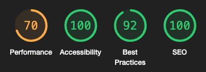

# Testing

## TOC

- [Navigation](#navigation)
- [Authentication](#authentication)
- [Car](#car)
- [Account](#account)
- [Code Validation](#code-validation)
  - [JSX](#jsx)
  - [CSS](#css)
  - [Lighthouse Scores](#lighthouse-scores)
- [Responsiveness](#responsiveness)

### Navigation

| Test # | Test                                                                                                                                            | Result |
| ------ | ----------------------------------------------------------------------------------------------------------------------------------------------- | ------ |
| 1      | _As a_ user, _I can_ find and access the navigation bar on every page _so that_ I can easily navigate to the different sections of the website. | PASS   |
| 2      | _As a_ user, _I can_ continue scrolling without pagination _so that_ I can find more car ads.                                                   | PASS   |
| 3      | _As a_ user, _I can_ search for keywords in the search bar _so that_ I can easily find thet car with specs that I am looking for.               | PASS   |

### Account

| Test # | Test                                                                                                    | Result |
| ------ | ------------------------------------------------------------------------------------------------------- | ------ |
| 1      | _As a_ user, _I can_ find a column that shows the top sellers _so that_ I can easily check those first. | PASS   |
| 2      | _As a_ user, _I can_ click on a profile _so that_ I can find more information about the seller.         | PASS   |
| 3      | _As a_ user, _I can_ edit my profile _so that_ I can update or change my information.                   | PASS   |

### Car

| Test # | Test                                                                                                              | Result |
| ------ | ----------------------------------------------------------------------------------------------------------------- | ------ |
| 1      | _As a_ user, _I can_ delete the car ad _so that_ I no longer are showing it to other visitors.                    | PASS   |
| 2      | _As a_ user, _I can_ edit the car ad _so that_ I can update the information.                                      | PASS   |
| 3      | _As a_ user, _I can_ create an ad for my car _so that_ others can view my ad and make inquiries to buy my car.    | PASS   |
| 4      | _As a_ user, _I can_ find all the cars on the main page _so that_ I can look for cars that may be of my interest. | PASS   |
| 5      | _As a_ user, _I can_ click on a car _so that_ I can view more details about the car.                              | PASS   |

### Authentication

| Test # | Test                                                                                                               | Result |
| ------ | ------------------------------------------------------------------------------------------------------------------ | ------ |
| 1      | _As a_ user, _I can_ register an account _so that_ I can access all the site features and create a car sales ad.   | PASS   |
| 2      | _As a_ user, _I can_ login to my account _so that_ I can use the sites features and access my profile.             | PASS   |
| 3      | _As a_ user, _I can_ logout _so that_ I can keep my account secure                                                 | PASS   |
| 4      | _As an_ admin, _I can_ set the access tokens to refresh _so that_ users are not logged out automatically to often. | PASS   |

## Code Validation

### JSX

The JSX code was validated during the development process and corrected as the project proceeded.

### CSS

To ensure there were no syntax errors, the W3C CSS Validator Service was used to validate the project's custom CSS files.

### Lighthouse Scores

The Lighthouse Scores were overall high for the metrics for accessibility, best practices and SEO for both desktop and mobile devices. The performance metrics however were impacted by the large image sizes causing long loading times for the site. For future updates I will investigate possibilities to have cloudinary to resize the images on upload automatically to speed up the site.

- Main Page Desktop

- Main Page Mobile

### Responsiveness

The website was thoroughly tested using the [responsivetesttool.](https://responsivetesttool.com/)

Return to [README.md](README.md)
